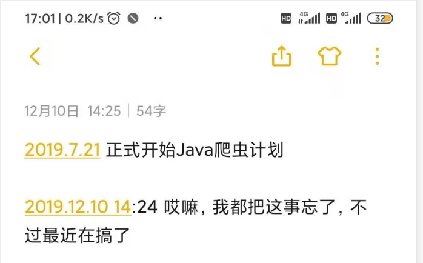
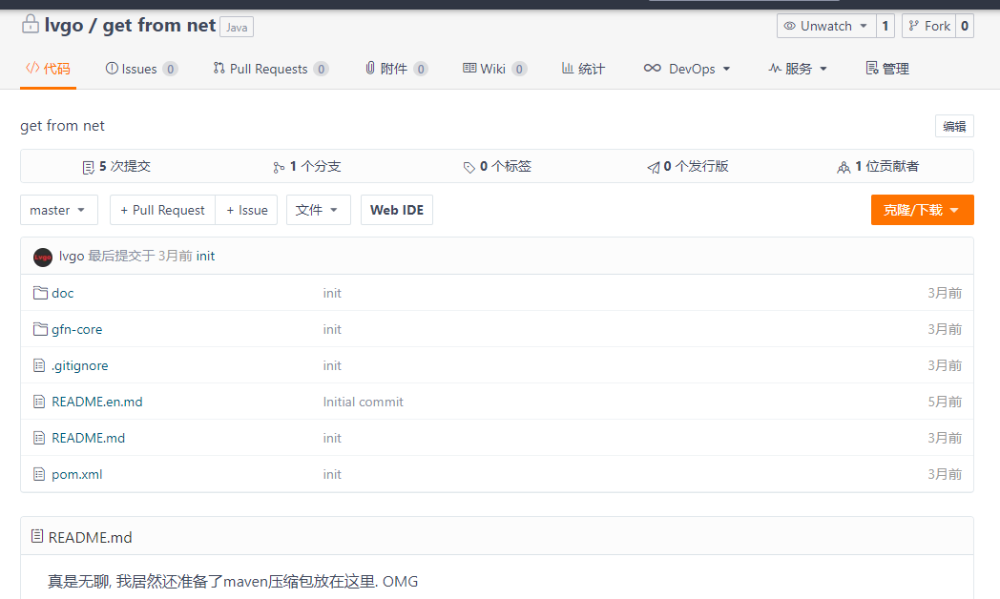

# octopus 大八爪鱼 砰!砰!

#### 2016-07 萌芽出现

知道爬虫这个东西, 是因为一个单词的出现 python 蟒蛇

---

心心念念好长时间 , 没继续了解 , 也不清楚到底什么是爬虫

---

#### 2018-03 初尝禁果

在网上照着抄了一个爬取图片的程序 https://gitee.com/lvgo/octopusData-down 很显然, 这使我很开心

---

之后不知道过了多久, 我接连fork了几个项目

https://github.com/code4craft/webmagic  (Scala) 通过xpath解析

再有

https://github.com/lvgocc/ispider 这个项目是受作者的博客 (http://blog.51cto.com/xpleaf/2093952) 影响找到的

还有其他很多博客和项目也看了一些, 主要这两个看了一些源码, 对爬虫才算真正有了一点概念. 知道了一些关于爬虫的事情, 比如 反爬虫,反反爬虫,反反反爬虫,反反反反爬虫,反反反反反爬虫.....

---

#### 2018-07-04 混沌之梦

写了许多后台接口 , 发现无处施展, 因为Java底子还不错, 搭了环境开发了个自己的APP, 没错, android app , 当时天真的想着把我的爬虫大梦控制台放在我的android app 上. 结果 android 坑填不上了, 在android的路上越走越远 ,爬虫项目没搞出来, 好在后面工作忙, 断了 app 这条路(找个借口) , app 的坑到挖了很深, app 基本页面开发了一些.... 还自己写后台接口 , 集成各种 api , 支付.. 第三方登录.. 定位...

---

#### 2019-07-21 梦醒时分

 

终于 ... 我象征性的建了一个仓库 
 
之后就不了了知了.......

后来

当然, 这段时间没闲着, 除了忙碌的工作以外, 真的很忙.....

我开发了一个多线程任务处理组件, 欢迎大家品尝, 后面的 octopus 里面也有用到, 组件已经发布到中央仓库

https://gitee.com/lvgo/silent

https://github.com/lvgocc/silent

---

#### 2019-10-22 杨帆!起航

经历了之前的种种种种, 立下了无数的flag , 这一次, 我不想在逃了

---

#### 2019-10-22

第一个commit, octopus诞生

---

#### 2019-11-04

提交 readme 梳理 octopus 结构, 罗列问题 , 逐个解决补充

---

#### 2019-12-10 初试

octopus 逐渐雏形, 提交第一个demo , 抓取新浪博客数据

---

#### 2019-12-11 IP?

完善插拔式配置, 尝试抓取豆瓣影评, 问题随之出现, 在抓取560条记录后, 出现ip问题

 
 

---

#### 2019-12-12

- [X] 集成 [silent](https://github.com/lvgocc/silent) 组件
- [ ] 代理IP问题

在集成 silent 过程中, 持续增加 octopus 插拔式配置 , 今日增加
1. 超时 timeOut 参数
2. 线程数设置 threadSize
3. 分页大小, 以及固定抓取几页

代理问题可能需要购买代理ip来解决, 暂时放一放, 口子留好, 继续往下走

#### 2019-12-13

- 数据的多线程解析需要对silent在处理一下, 提高开发效率, 让使用者更多的关心业务逻辑.
这其中需要将 TaskHandel 提取出来, 抽象到一个 BaseExtract 里面

- [ ] 提取多线程解析

---

#### 2019-12-16

提供多线程默认方法时发现, 需要将多线程方法提供为公共方法, 但是其中解析部分又为用户自定义, 于此出现冲突

既想抽象出来多线程方法, 又想面向接口编程

最终感谢 Java 大佬们的支持, JDK1.8 提供了我的这种想法, 面向接口编程, 却又可以提供默认方法

在接口中, 增加用 default 关键字修饰的方法即可

- [X] 提取多线程解析

....

代理IP的问题搞一下, 先去学习一下. ``不断的探索和整理是我知识的源泉`` ---- 他说

在解决代理IP的时候 , 想要通过随机数获取代理IP数组中的代理IP , 在ArrayList 中的 get() 方法, 时突然想确认一下数组的最大长度, (一直以为是int的最大值) , 为 Integer.MAXVALUE - 8

这原因是因为 Java 的对象头搞的鬼, 不同的 VM 存储对象头内容大小不一致, Java 考虑到虚拟机内存问题, 减去 0001 

- [ ] 代理IP问题

---

#### 2019-12-17

想着解决一下代理IP问题, 结果一下把 西刺爬废了, 503 . 

怎么才能让这套代码变成一个框架呢? 还得再改进

整理了一些代码, 增加了ThreadLocal Document 对象限制, 不然之前的多线程放进来有问题

就豆瓣影评例子, 补充一下评论结果展示 评论星级

---

#### 2019-12-24 19:27:22

最近事情比较多，好久没过来看octopus了，昨天公司有个关于事务的测验，居然出乎意料的拿了最高分。。。

对于事务的基本使用，和同事分享了自己的一点小经验，同样也整理成了文章，在这里也分享给有幸认识的你 [戳我](https://blog.csdn.net/sinat_34344123/article/details/103684560)

在来看之前的问题，之前问题还在代理IP的问题，我这里决定增加几个常见的代理IP获取。

其实具体的代理IP的话，就比较容易，要付费，然后给你一个数据接口。。。

但我们要做的是``白嫖``

- [ ] 暂时通过爬取免费代理IP来解决代理IP问题.
- [X] ~~或者通过付费方式解决~~

#### 2020年4月26日10:11:39

#### 2020年5月14日09:17:20

开发方向转变, 将octopus变成一个web可部署的应用方向. 其中仍保留爬虫系统内容, 且与web应用独立

#### 2020年5月27日17:58:54

增加了手动MybatisPlus生成代码类.

2020年5月27日19:13:32

又看了一下大佬的作品 https://github.com/lvgocc/webmagic/blob/master/webmagic-core
发觉自己似乎做的有一些问题, 我讲octopus类封装的过于臃肿, 维护和扩展变得异常复杂. 准备重新梳理思路
重新考虑模块设计.

2020年5月28日09:19:46

2020年5月29日15:14:38

重新梳理思路后出现一个问题:

输入一url - 返回 html 
输入html - 解析 - 返回 data
.
.
.
在输入的html中发现, 需要的数据不在这个页面, 而在这页面中的下一个页面.
这里引入了知识点, 深度优先搜索

简单的例子场景, 豆瓣影评. 我们点开豆瓣网站的电影栏目, 

 

点开之后是一个豆瓣电影列表.

 

点击任意一个电影, 然后选择更多影评, 此时我们看到的是
 
 

现在是处于详情列表中, 我们需要点击这里才可以看到详情

  
 
   

解决的问题就是我们在详情列表中可以得到10个详情url. 我需要我的程序可以爬完1之后退出来, 然后继续爬第2个

从一开始就只需要输入一个目标网站, 然后提供策略参数(需要爬什么, 怎么爬.)

比如我输入一个 douban.com, 然后策略 movie , 那就是爬取豆瓣的电影数据.

